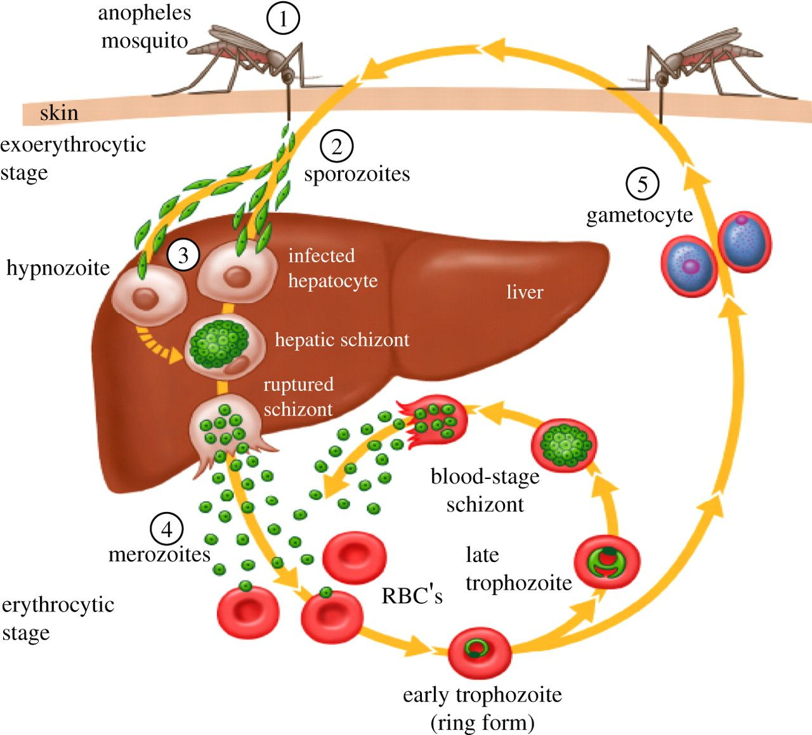

# Diagnose-malaria
### malaria
Malaria is a disease caused by a parasite. The parasite is transmitted to humans through the bite of the infected mosquito. People with malaria usually feel very sick, with a high fever and chills.

### Symptoms
Malaria signs and symptoms include:

* fever
*  chills
*  general feeling of discomfort
*  headache
*  Nausea and vomiting
*  diarrhea
*  Tummy ache
*  Joint or muscle pain
*  fatigue
*  breathing rate
*  fast heart rate
*  cough
